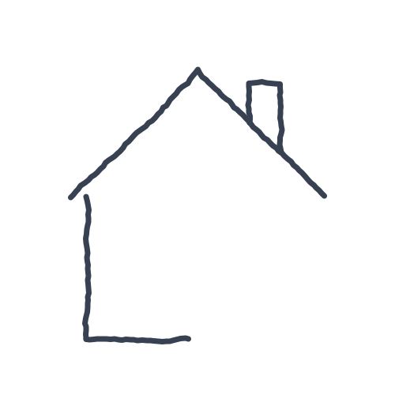
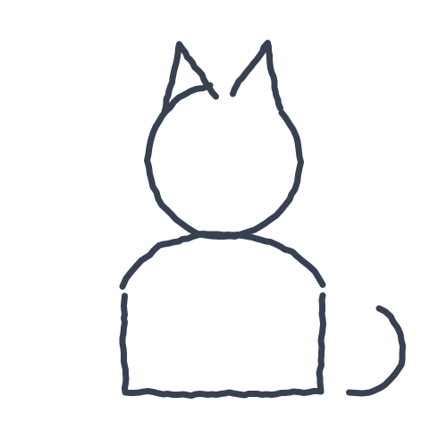
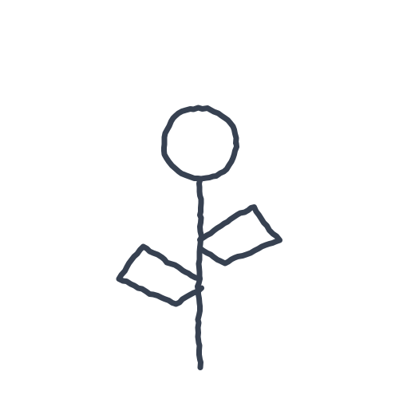

# 0003 — Finish the doodle

| | |
|---|---|
| **Phase** | Sketch |
| **Status** | Draft |
| **Owner** | @cpluntke |
| **Last updated** | 2026-09-13 |
| **Links** | concept research: [Senior Care Penalty Map](https://claude.ai/code/artifact/d43759e2-23b2-4ea1-beed-57452bcc28b2); shares the pad with [0002](0002-sign-the-guest-book.md); Anna's starts in `docs/assets/0003/starts/` |

> A grandchild and the person draw on the same picture at the same time, each on their own phone. Anna starts it and waits; the person joins and they finish it together. The live invitation is the reason to open the app. Whether it gets answered, how soon, and whether anything gets drawn is the signal.

> **Sketch phase:** fill sections 1–5 and 8–9; leave 6 as a rough note and 7 as
> N/A. **Prototype phase:** fill everything, and record in the Decision log
> what the sketch taught us and what changed.

## 1. Problem

Hypoactive delirium, the most common and most missed kind, looks like
withdrawal: the person simply does not open the app. A missed day only means
something if there was a real pull to open it, and a plain daily check-in
(0002) is a weak pull. "Anna is here and wants to draw with you now" is the
strongest pull we can make: a real person, present, waiting, asking for a
small creative act rather than a test. Today there is nothing at home that
gives either.

**Load-bearing hypothesis.** One task that is creative, social, and live gets
answered more reliably, and sooner, than a check-in that is none of those.
If that is true, drawing together is the daily engagement probe and the
guest book (0002) is the daily motor probe, and they are complementary rather
than competing. If it is false, this sketch is parked and 0002 carries the
daily visit alone. The sketch exists to test this, not to measure strokes.

## 2. Users and jobs to be done

- **Who:** the person (80+); a family member who starts drawing sessions
  (any age, often a grandchild); a caregiver who set the pairing up.
- **Job (person):** "When Anna wants to draw with me, I want to sit down and
  draw with her for a few minutes, so we have a little time together."
- **Job (family):** "When I have five minutes, I want to do something with
  Grandma that isn't a phone call, so I know she's engaged today."
- **Context:** person on a tablet or phone; family on their own phone;
  both at the same time, so the family side has to be able to wait, and the
  person's side has to work when Anna is impatient.

## 3. Goals and non-goals

**Goals**
- Test the hypothesis: log, per session, when the invitation was sent, when
  the person opened it, when they joined, when their first line was drawn,
  and when the session ended, so answer rate and time-to-join can be
  compared with the guest book (0002) over the same days.
- The person's loop works end to end: see Anna's invitation, join, see
  Anna's lines appear as she draws, draw alongside, finish, see the picture.
- Joining takes one tap and never fails. A single dot counts as drawing.
- Anna leaving does not strand the person: the picture stays and can be
  finished alone; Anna sees it later.
- Empty state is still worth opening: with no invitation waiting, the person
  can ask Anna to draw.

**Non-goals** (explicitly out of scope for this iteration)
- Stroke kinematics as a signal. A different picture each day has no
  baseline to deviate from; that is 0002's job. Strokes are recorded in
  0002's format so the question can be revisited later, but nothing is
  computed from them.
- Voice or video during drawing. The picture is the conversation.
- More than two people in a session, or more than one family member.
- Accounts, push notifications, a real backend. The sketch runs both sides
  in one browser (see 6.1).
- Colours beyond one per side, brushes, erasers beyond "Undo my last line".
- Scoring the picture.
- Anything that does not fit the one-hour sketch build.

## 4. Success criteria

- A tester joins a session and draws alongside a second tester within one
  minute of the invitation, with no spoken help.
- Both sides see the same picture within a second of each line being drawn,
  and the person's own lines appear with no visible delay.
- Over three days with both sketches installed, the invitation is answered
  on at least as many days as the guest book is signed, and sooner after it
  arrives. (Three days is a smoke test, not evidence; it tells us whether
  the comparison is worth running for real.)
- The family side shows, for each session, "Joined after 4 minutes, drew for
  3 minutes" computed from the logged times.

### 4.1 Sketch verdict

Filled in at the mid-way review. What we tried, what we learned, and whether
it goes forward.

| Tried | Learned | Verdict (Selected / Parked / Folded into NNNN) |
|-------|---------|-------------------------------------------------|
| | | |

## 5. Product design

### 5.1 User flow

Family:
1. "Draw with Margaret": pick one of Anna's three started doodles
   (`docs/assets/0003/starts/`: "Half a house", "A cat with no face", "A
   flower with no petals") or a blank page. Primary: "Ask Margaret to draw".
2. Waiting: the start is on the pad, Anna can keep drawing while she waits.
   A line says "Waiting for Margaret" and, once she opens it, "Margaret is
   here". Secondary: "Stop waiting" (the picture is kept as a doodle to
   finish later).
3. Drawing together, then "Finished for today" and the finished picture with
   one line: "Joined after 4 minutes, drew for 3 minutes."

Person:
1. Ernie: "Anna wants to draw with you now." Under it, Anna's invite for the
   start she picked ("I drew the roof. Can you finish the house, Grandma?").
   Primary: "Draw with Anna".
2. Drawing page: the shared pad. Anna's lines in dark grey, the person's in
   blue; a legend says "Anna's lines" and "Your lines", and a status line
   says "Anna is drawing" or "Anna has stopped for now". Secondary: "Undo my
   last line", "Start my part again". Primary: "Finished for today".
3. Confirm: "Stop drawing with Anna?" with the picture. "No, keep drawing" /
   "Yes, we're done".
4. Done: "Lovely. Anna has the picture too." Primary: "Carry on".

If Anna stops waiting before the person joins, step 1 says "Anna started a
drawing for you" and the person finishes it alone, as in an ordinary doodle;
Anna sees the result later. That fallback is the previous version of this
sketch and costs nothing extra.

### 5.2 Screens and states

| Screen | Purpose | Primary action | States (empty / loading / error / success) |
|--------|---------|----------------|--------------------------------------------|
| Invite | announce the session | Draw with Anna | nothing waiting ("Ask Anna to draw with you?"); Anna waiting now; Anna started one and left (finish alone); already drew together today ("You drew with Anna at 10 am") |
| Draw together | the shared pad | Finished for today | joined, Anna drawing; Anna paused ("Anna has stopped for now"); Anna left ("Anna had to go. You can keep drawing; she'll see it."); untouched by the person (Finished still allowed, logged as joined-no-draw); after Undo; after Start my part again (Anna's lines kept); connection lost, N/A for the sketch |
| Confirm finish | prevent accidental exit | Yes, we're done | default |
| Done | close the loop | Carry on | finished together; finished alone |
| Family: start | choose a start and invite | Ask Margaret to draw | none picked (button disabled); one picked; blank page |
| Family: waiting / drawing | draw while waiting, then together | Finished for today | waiting; Margaret opened it; Margaret drawing; Margaret finished first |
| Family: finished | show the result and the engagement line | none (Go back) | finished together; Margaret never joined ("Not yet. She'll see it next time she opens Ernie.") |

Mockups: Anna's three starts rendered in `docs/assets/0003/starts/*.svg`:

| Half a house | A cat with no face | A flower with no petals |
|---|---|---|
|  |  |  |

### 5.3 Copy and tone

- The invitation names the person and the moment: "Anna wants to draw with
  you now", "Draw with Anna".
- Presence in words, never only a dot: "Anna is drawing", "Anna has stopped
  for now", "Anna had to go".
- "Undo my last line", not "Undo". "Start my part again", so Anna's lines are
  clearly kept.
- Ending is gentle and shared: "Finished for today", "Stop drawing with
  Anna?", "Yes, we're done".
- Never "Submit", "Upload", "Share", "Session", "Connect", "Online".

### 5.4 Accessibility and edge cases

Checklist from `docs/research/design-criteria-80-plus.md` section 3:

- [x] One primary action per screen; ≤ 5 tappable things (Draw page: Undo, Start again, Finished, Go back, Start)
- [x] Every target ≥ 48 px with visible gaps; the pad itself is the largest target
- [ ] Tap-only; no gesture is the sole path. **Known deviation, decided in
  6.4:** drawing is continuous touch, as in 0002. A single dot counts, and
  "Go back" leaves the session without drawing.
- [x] Body text ≥ 18 px, works at 200% zoom (pad scales with width)
- [x] Text contrast ≥ 7:1. Lines are non-text: Anna's use the soft ink token
  (`--ernie-ink-soft`, about 10:1 on white), the person's the primary blue
  (about 8.7:1), and the legend labels them so the difference is not colour alone
- [x] Every icon has a text label
- [x] No web jargon; labels say what happens
- [x] Undo or back from every screen; finishing is confirmed
- [x] Errors are plain, local, and say how to fix (the sketch has none)
- [ ] Nothing moves, times out, or disappears on its own. **Known deviation,
  decided in 6.4:** Anna's lines appear on the pad without the person doing
  anything. They appear where drawn, with no animation, and the status line
  says "Anna is drawing" so the change is announced in words. Nothing ever
  disappears, and the invitation does not expire on the person's side
- [x] Anything audible has a visual equivalent (no sound)
- [x] A helper/caregiver can set it up (pairing) and family can assist

Edge cases: page scroll must be locked while drawing on the pad (same
`touch-action: none` risk on iPad Safari as 0002); stylus, finger and mouse
all accepted; the person's own lines are drawn locally at once and never wait
for Anna's side; both drawing at the same spot just overlaps, there is no
conflict to resolve; if the person taps "Finished" first, Anna's side says
"Margaret has finished" and she can stop when she likes; a person who joins
and never draws is logged as joined, which is still signal; one session at a
time.

## 6. Engineering design

### 6.1 Approach

Rough note. Same pad and stroke recorder as 0002, recording pointer events as
`{x, y, t}` per stroke, so the pad is one component with two users: 0002
computes features from it, 0003 streams strokes and stores them. Each side
draws its own strokes immediately (local echo) and broadcasts points in small
batches; the other side appends them to the same picture. A session is a
list of strokes tagged by author plus a handful of timestamps.

For the sketch, both roles live in one web app under two routes and talk
over `BroadcastChannel`, so the demo runs as two tabs (or two windows side by
side) in one browser with no server. That is enough to show two people
drawing on one picture. For the prototype, a small relay (WebSocket) would
replace the channel with the same message shape; that is a later slice, not
what the sketch tests. **Riskiest unknown:** whether a two-tab demo reads as
"two people, two phones" to someone watching, and whether the live invitation
is realistic without a way to schedule it (see 8).

### 6.2 Data model

Sketch, one record per session:

```
{ id, from, to, startId | null,
  strokes: [{ author: "family" | "person", points: [{x, y, t}] }],
  invitedAt, openedAt, joinedAt, firstStrokeAt, endedAt,
  endedBy: "family" | "person" | "family-left" }
```

`startId` names one of the three shipped starts (`docs/assets/0003/starts/`);
their strokes (author `family`) seed the record when the session is created,
and live strokes from both sides are appended as they are drawn.

Messages on the channel: `invite`, `open`, `join`, `stroke` (author, stroke
id, a batch of points, `done` flag), `undo` (author, stroke id), `clear-mine`
(author), `finish` (by). Timestamps are set by the receiver's clock; the
sketch does not need clock sync.

Engagement line on the family side is derived: time-to-join = joinedAt −
invitedAt; drawing time = endedAt − firstStrokeAt. The same timestamps are
what the comparison with 0002 uses.

### 6.3 API / interfaces

N/A.

### 6.4 Key decisions and alternatives

| Decision | Chosen | Alternatives considered | Why |
|----------|--------|-------------------------|-----|
| Synchronous or asynchronous | both draw at the same time; finish-alone is the fallback | send a start, finish later (previous version) | owner: a live person waiting is the strongest social pull, and it is what the hypothesis is about; the async path is kept as the fallback so an unanswered invitation is still a usable doodle |
| What the sketch tests | engagement (answer rate, time-to-join) vs 0002 | stroke kinematics shared with 0002 | a doodle has no stable template, so kinematics would restate 0002's claim with weaker evidence |
| Start of the session | Anna picks one of three shipped starts or a blank page | free drawing only | a half-drawn thing gives the person something to do the moment they join, and gives Anna something to draw while she waits |
| Transport for the sketch | `BroadcastChannel` between two tabs | WebSocket relay, WebRTC, polling a shared store | zero server, buildable in the hour; the relay is a drop-in later because the message shape is the same |
| Live changes on screen | allowed, announced in words, no animation | strict "nothing moves" | the whole point is another person's presence; the criterion exists to prevent surprise, and a named person drawing is not a surprise |
| Drawing input | continuous touch, deviation from tap-only | tap-to-place dots | a dot-only doodle is not creative; mitigated by "a dot counts" and Go back |
| Ending | either side, confirmed on the person's side, picture kept | timer, family-only | no time limits for this audience; finishing must never feel like being cut off |
| Who sees the engagement line | the family, in the sketch | caregiver only | it is the demo of the signal; who sees it in the product stays open (8) |

### 6.5 Dependencies and risks

N/A.

### 6.6 Testing and rollout

N/A.

## 7. Plan

N/A.

## 8. Open questions

| Question | Owner | Needed by |
|----------|-------|-----------|
| How does Anna know when Grandma is likely to be there? A fixed daily slot, a "Grandma is up" signal from the guest book, or just try and fall back? | @cpluntke | mid-way review |
| In the product, does the family see the engagement line or only the caregiver, and does the person know it is seen? | @cpluntke | mid-way review |
| Can the person start a session ("Ask Anna to draw with you"), and what happens on Anna's phone when they do? | @cpluntke | mid-way review |
| Can Anna send a photo to draw on, or only lines? | @cpluntke | prototype phase |

## 9. Decision log

Newest first. Record what changed and why, so the doc stays a living record.

| Date | Change | Reason |
|------|--------|--------|
| 2026-09-13 | Made the doodle synchronous: both draw on the same pad at the same time, with finish-alone as the fallback; flow, states, copy, data model, channel messages and transport decision rewritten; two checklist deviations recorded (touch drawing, live changes on screen); scheduling question added | Owner: the grandchild and the senior should draw together live |
| 2026-09-13 | Added Anna's three started doodles as stroke data and SVG in `docs/assets/0003/starts/`, with her invite line per start | Owner: the prototype should ship three starts created in the grandchild's name |
| 2026-09-13 | Reframed around the load-bearing hypothesis (creative + social pull beats a plain check-in); stroke kinematics moved to non-goals; family side cut to a stub; queueing, offline and gallery removed; line colours specified; recorder format aligned with 0002 | Review: the sketch was restating 0002's signal with weaker evidence, and the family side was undecided but load-bearing for the build |
| 2026-09-13 | Created | Brainstorm pick: the social pull that makes a missed day meaningful |
