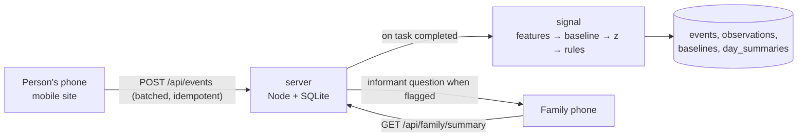

# 0007 — Data capture and analysis

| | |
|---|---|
| **Phase** | Sketch |
| **Status** | Draft |
| **Owner** | @cpluntke |
| **Last updated** | 2026-09-13 |
| **Links** | 0002–0006 (the games this serves); concept research: [Senior Care Penalty Map](https://claude.ai/code/artifact/d43759e2-23b2-4ea1-beed-57452bcc28b2) |

> The smallest backend that lets a mobile website capture every tap and stroke from the games, turn them into per-day features against a personal baseline, and show "today vs usual" on a mocked family page. One Node process, one SQLite file, no accounts for the person. Family links and photo upload are out of scope: the family view is a stub route and photos are seeded.

> **Sketch phase:** fill sections 1–5 and 8–9; leave 6 as a rough note and 7 as
> N/A. **Prototype phase:** fill everything, and record in the Decision log
> what the sketch taught us and what changed. _This doc is infrastructure, so
> section 6 is filled at sketch depth already._

## 1. Problem

The games only mean something if their data leaves the device: the family
view is on another phone, a missed day must be visible as a missed day, and
the signal is a comparison across days that the browser's local storage
cannot be trusted to keep (iOS evicts it). We need one place that receives
raw events from the person's phone, computes features and baselines, and
answers the family's one question. It is a mobile website, not an app, so
capture has to survive page reloads, poor signal, and Safari.

## 2. Users and jobs to be done

- **Who:** the person's phone (sends), the family member's phone (reads),
  the caregiver who sets things up once, and us, who need to re-run the
  analysis when the method changes.
- **Job (system):** "When a game finishes, I want the raw strokes and taps
  stored safely and turned into today's features, so the family sees a
  plain-language comparison within a minute."
- **Job (us):** "When we change a feature or a threshold, I want to recompute
  every day from the raw data, so the method can improve without losing history."
- **Context:** mobile Safari and Chrome; short sessions; sometimes offline
  for a moment; a demo that must run with one command.

## 3. Goals and non-goals

**Goals**
- Capture raw, not derived: every event with timestamps, so analysis is
  reproducible and re-runnable.
- No log in for the person. A link on their phone is their identity.
- Family view is a mock: a second route in the same site, no link or identity of its own, reading the same summary the real one would.
- One generic event stream for all games (0002–0006), one analysis module
  shared by client and server.
- "No visit today" is a first-class record, not an absent row.
- Runs locally with `npm start`; deploys as one process plus one file.

**Non-goals** (explicitly out of scope for this iteration)
- Admin portal, clinician dashboard, or multi-household management.
- A real family link, family identity, or revocation. The family route is open in the prototype.
- Photo upload or a setup screen for names and photos. People, names, words, clues and photos are seeded from a JSON file in the repo; we assume they "come in somehow" later.
- Push notifications. The family sees changes when they open their link.
- HIPAA-grade controls, audit logging, or encryption at rest beyond disk.
- Model-rated chat (0006) and any speech capture.
- Scaling past a handful of households.

## 4. Success criteria

- A signing on the person's phone appears in the family view, with today's
  sentence, within one minute, on a different device.
- Killing the page mid-game loses no completed event; a reload resumes
  the session.
- Re-running the analysis over stored raw events reproduces the same
  day summaries.
- A day with no session shows in the family strip as "No visit".
- A fresh database seeds one household with people and photos on first
  start, so the demo runs with one command.

### 4.1 Sketch verdict

N/A. Infrastructure for whichever game sketches are selected.

## 5. Product design

### 5.1 User flow

1. On first start the server seeds one household from `seed.json`: the
   person's first name, family names, relations, photos, words and clues.
   It prints the person's link. (Setup screen and photo upload: later.)
2. The person opens their link. The page starts a session, plays the games,
   and sends events as they happen. If the phone is offline, events queue
   and send later.
3. The mock family page (`/family`, open, no link) shows the last seven days
   and one sentence for today. On a flagged day it asks the informant
   question: "Has Margaret seemed more confused than usual today?" Yes / No.

### 5.2 Screens and states

| Screen | Purpose | Primary action | States (empty / loading / error / success) |
|--------|---------|----------------|--------------------------------------------|
| Person link landing | start the day | Start | first visit ("Add this page to your home screen"); returning; link revoked ("Ask Anna for a new link") |
| Family view (mock) | today vs usual | none (or answer the question) | no data yet ("Margaret hasn't signed yet"); baseline building ("3 of 6 days"); normal; different from usual; no visit today |
| Informant question | caregiver check | Yes / No | asked; answered |

Mockups: `docs/assets/0007/` (none yet).

### 5.3 Copy and tone

- Family sentences are plain and signed: "Margaret's signature was slower
  and shakier than usual today." "Margaret didn't visit today."
- While the baseline builds: "We're learning what's usual for Margaret. 3 of 6 days."
- Never "score", "risk", "delirium" on the family view in this iteration.

### 5.4 Accessibility and edge cases

The person's side is covered by the game docs. For this doc: the person's
link must work with no typing (opened from a message, saved to the home
screen); the family view must pass the same 80+ checklist since family
members are often 60+ themselves; the informant question is one screen, two
buttons. Edge cases: two sessions in one day (keep both, summarise the
first completed); clock skew between phone and server (use server receipt
time for the day, client deltas for within-session timing); a person link shared
with the wrong person (revoke and reissue by hand in the prototype).

## 6. Engineering design

### 6.1 Approach

One Node 22 process serves the built mobile site and a small JSON API, with
SQLite as the store. Analysis is a pure TypeScript package with no
dependencies, imported by the server (for real data) and by the client
(for demo mode and offline preview). Three packages in the existing
workspace: `packages/web` (the mobile site, ernie-ui), `packages/signal`
(feature extraction, baselines, rules), `packages/server` (API and DB).

Capture: the client appends events to an in-memory queue mirrored to
IndexedDB, sends in batches every few seconds and on `pagehide` via
`sendBeacon`. Every event carries a client-generated id, so retries are
harmless. Within-session times are client deltas from session start; the
server stamps receipt time and derives the calendar day in the household's
time zone.

Analysis runs synchronously in the request when a `task.completed` event
arrives: extract features for that task, update the baseline if the day is
in the baseline window, compute robust z and the composite, upsert the day
summary, and evaluate rules. A nightly job (or on-read fallback) writes a
"no visit" summary for days without a session. `npm run reanalyse` drops
observations, baselines and summaries and recomputes them from events.

### 6.2 Data model

| Table | Fields | Notes |
|---|---|---|
| households | id, person_name, tz, created_at | one per person |
| links | token, household_id, role (person only for now), revoked_at | identity is the link; family and setup roles later |
| devices | id, household_id, user_agent, pad_width, first_seen | baselines are per device |
| sessions | id, household_id, device_id, started_at, ended_at, day | one per visit |
| events | id (client uuid), session_id, task, kind, t_ms, received_at, payload JSON | append-only; raw strokes and taps live here |
| observations | id, household_id, device_id, task, day, features JSON, computed_at, method_version | derived; one per completed task per day |
| baselines | household_id, device_id, task, window_days, median JSON, mad JSON, template JSON, updated_at | derived |
| day_summaries | household_id, day, visited, z JSON, composite, flags JSON, sentence, computed_at | derived; "no visit" rows included |
| informant_answers | household_id, day, answered_by, answer, answered_at | caregiver yes/no |
| people | id, household_id, name, relation, photo_path, words JSON, clues JSON | content for 0003–0005; seeded from `seed.json`, photos served from `packages/server/seed/photos/` |

Event kinds per task, so every game fits the same stream:

- `session.started`, `session.ended`
- `signature.shown`, `signature.stroke` (points), `signature.completed`, `date.answered`
- `doodle.opened`, `doodle.stroke`, `doodle.sent`
- `wordsearch.shown`, `wordsearch.tap` (cell, result), `wordsearch.found`, `wordsearch.hint`, `wordsearch.completed`
- `crossword.clue_shown`, `crossword.tile` (placed or taken back), `crossword.checked`, `crossword.hint`, `crossword.completed`

Payloads are JSON so a new game needs no migration. `method_version` on
observations lets old rows be recomputed when the feature set changes.

### 6.3 API / interfaces

Person routes take the link token as a bearer header. Family routes are
open in the prototype and read the single seeded household.

| Route | Role | Body / response |
|---|---|---|
| `GET /api/me` | person | what is due today, already done, names and photos for the games |
| `POST /api/sessions` | person | `{deviceId, clientStart}` → `{sessionId}` |
| `POST /api/events` | person | `[{id, sessionId, task, kind, t, payload}]` → `{accepted: [ids]}`; duplicates accepted silently |
| `GET /api/family/summary?days=7` | open (mock) | `[{day, visited, sentence, flags, signaturePath, composite}]`, baseline status, pending question |
| `POST /api/family/informant` | open (mock) | `{day, answer}` |

`packages/signal` exports pure functions: `signatureFeatures(strokes, padWidth)`,
`robustBaseline(observations)`, `zScores(features, baseline)`,
`composite(z)`, `rules(daySummaries)` → flags, and `sentence(person, z, flags)`.

### 6.4 Key decisions and alternatives

| Decision | Chosen | Alternatives considered | Why |
|----------|--------|-------------------------|-----|
| Hosting shape | one Node process + SQLite file | Supabase or Firebase; serverless | runs with `npm start` for the submission; no external account or network policy to explain |
| Identity | capability link for the person only; family route open | magic-link email, passwords, OAuth | the person never types; the family side is mocked in this iteration so no second identity is needed |
| Content | seeded JSON and photos in the repo | setup screen, photo upload | not what the prototype tests; assumed to arrive later |
| Where analysis runs | server, from raw events | client computes and uploads features | one source of truth; recomputable when the method changes; client uses the same module only for demo mode |
| Event shape | generic stream with JSON payloads | a table per game | new games need no migration; replay is trivial |
| Timing | client deltas + server receipt | trust client clocks | phone clocks drift; deltas are what the features need |
| Offline | IndexedDB queue + sendBeacon | require online | short signal loss is normal at home; nothing may be lost |
| Missing days | explicit "no visit" rows | infer from gaps in the view | absence is signal for hypoactive delirium and must be queryable |

### 6.5 Dependencies and risks

Node 22, `better-sqlite3`, a small router (Hono or Express), `ernie-ui`.
Risks: capability links leak if a message is forwarded (mitigated by
revoke and reissue; a real product needs more); iOS Safari may evict
IndexedDB for a site not added to the home screen (mitigated by sending
promptly and by the "Add to home screen" step); running analysis in the
request is fine for one household and wrong at scale (move to a queue
later); health-adjacent data with no formal compliance in this iteration.

### 6.6 Testing and rollout

Unit tests on `packages/signal` with synthetic strokes: a clean signature,
the same with added 6 Hz jitter (smoothness z must rise), the same drawn at
half speed (speed and time z must rise), a shifted and scaled copy (shape
distance must stay near zero). API smoke test: create household, start
session, post a signature, read the family summary. Manual: kill the tab
mid-signature and confirm the queue drains on reload. Rollout is a single
deploy; rollback is the previous build and the same SQLite file, since
migrations are additive.

## 7. Plan

| Milestone | Scope | Target | Status |
|-----------|-------|--------|--------|
| M1 | `signal` package: signature features, baseline, z, rules, sentence, tests | prototype hour | not started |
| M2 | server: seed, person link, sessions, events, family summary; SQLite | prototype hour | not started |
| M3 | client capture queue + demo mode; mock family page | prototype hour | not started |
| M4 | "no visit" rollup, informant question, reanalyse script | after | not started |
| M5 | real family link, setup screen, photo upload | after | not started |

## 8. Open questions

| Question | Owner | Needed by |
|----------|-------|-----------|
| Who owns the data and can delete it: the person, the caregiver, or both? | @cpluntke | before build |
| Do we keep raw strokes indefinitely, or downsample after the observation is computed? | @cpluntke | mid-way review |
| Household time zone from the caregiver at setup, or from the person's phone? | @cpluntke | before build |

## 9. Decision log

Newest first. Record what changed and why, so the doc stays a living record.

| Date | Change | Reason |
|------|--------|--------|
| 2026-09-13 | Family link mocked; photos and people seeded | Owner: mock the family link for now and assume images come in somehow |
| 2026-09-13 | Created | Owner asked for the backend sketch after settling the signature metrics; mobile website, no native app |
